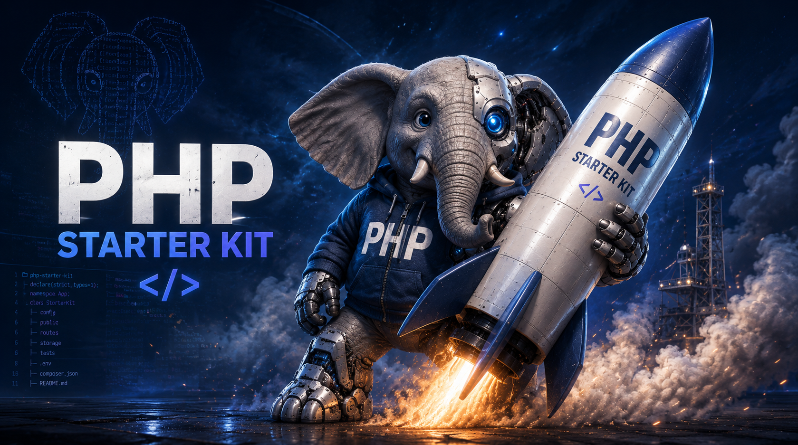

# PHP Starter Kit

Modern Docker-based starter kit for PHP applications built on **FrankenPHP** — a Caddy-powered PHP server with HTTP/2, HTTP/3, and automatic HTTPS.

[](http://php.net)
[](https://frankenphp.dev/)
[](https://www.docker.com/)
[](https://github.com/rdurica/php_starter_kit/actions)
[](LICENSE)




## Table of Contents

- [Overview](#overview)
- [Requirements](#requirements)
- [Available Commands](#available-commands)
- [Framework Installation](#framework-installation)
- [Environments](#environments)
- [Production](#production)
- [CI/CD](#cicd)
- [Security](#security)
- [License](#license)

## Quick Start

```bash
git clone https://github.com/rdurica/php_starter_kit.git && cd php_starter_kit && make init
```

Then open [https://localhost](https://localhost) (auto-generated certificate).

---


## Overview

This starter kit provides a ready-to-use, out-of-the-box local development environment for modern PHP projects. It comes preconfigured with everything you need to start coding immediately, without wasting time on setup and configuration.

**Key aspects:**

- **FrankenPHP** — Modern PHP application server with HTTP/2, HTTP/3, and automatic HTTPS
- **Secure by default** — Non-root user, security headers, hardened sessions, no `expose_php`
- **Multi-environment** — Dev, CI, and Demo configurations
- **Multi-stage production build** — Minimal attack surface, optimized layers
- **CI/CD ready** — GitHub Actions with code quality, tests, security scanning
- **DevContainer support** — VSCode remote containers out of the box
- **Framework agnostic** — Ready for Laravel, Symfony, and Nette
- **Frontend ready** — Node.js and Vite integrated in the dev container
- **Quality tooling** — PHPStan, PHP CS Fixer, ESLint, Prettier

## Requirements

- [Docker](https://docs.docker.com/get-docker/) & Docker Compose
- [Make](https://www.gnu.org/software/make/) (optional but recommended)
- `sudo` access for trusting local HTTPS certificates

## Available Commands

| Command | Description |
|---------|-------------|
| `make init` | First-time setup: network, images, containers |
| `make up` | Start containers in detached mode |
| `make down` | Stop and remove containers |
| `make logs` | Show live logs from all containers |
| `make php` | Open shell inside the FrankenPHP container |
| `make rebuild` | Force rebuild images (--pull --no-cache) |
| `make reload` | Rebuild images with cache |
| `make setup-githooks` | Enable pre-commit hooks |
| `make trust-cert` | Trust Caddy's local CA certificate |

## Framework Installation

Enter the PHP container and run the installer for your framework:

| Framework | Command | Web Root |
|-----------|---------|----------|
| **Laravel** | `laravel` | `src/public` |
| **Symfony** | `symfony new . --webapp --no-git` | `src/public` |
| **Nette** | `nette` | `src/www` |

```bash
make php
# Then run your framework command from the table above
```

> **Note:** For Nette, update `build/dev/Caddyfile` and change `root` to `/app/src/www`.

## Environments

### Development (`compose.yaml`)
- FrankenPHP with xdebug, Node.js, Git, Symfony CLI, Laravel installer
- Caddy auto HTTPS on https://localhost
- Vite dev server running in the background
- Volume mount for live code editing

### CI (`compose.ci.yaml`)
- Lightweight FrankenPHP image (no xdebug, no Node)
- SQLite in-memory for fast tests
- Ideal for GitHub Actions

### Demo (`compose.demo.yaml`)
- Self-contained stack with PostgreSQL and Redis
- Uses prebuilt GHCR image
- Port 8080 on host

## Production

Build the production image:

```bash
docker build -f build/prod/Dockerfile -t myapp:latest .
```

Run with the demo stack:

```bash
docker compose -f compose.demo.yaml up
```

## CI/CD

Three GitHub Actions workflows are included:

| Workflow | Description |
|----------|-------------|
| `code-quality.yml` | PHPStan, PHP CS Fixer, Composer audit, Frontend lint |
| `ci.yml` | Framework auto-detection, PHPUnit tests, Docker lint |
| `build.yml` | Multi-stage prod image build, GHCR push, Trivy security scan |

## Security

- Non-root user (`robbyte`, UID 1000) in all containers
- `COMPOSER_ALLOW_SUPERUSER` removed
- `expose_php = Off` in production
- Security headers: X-Frame-Options, X-Content-Type-Options, Referrer-Policy, Permissions-Policy
- Session hardening: strict mode, httponly, samesite
- OPcache and JIT enabled in production
- Healthcheck on `/up` endpoint
- Trivy vulnerability scanning in CI

## License

This project is licensed under the terms of the MIT license.
